# E-पसल (E-Pasal) — Full-Stack E-Commerce Platform

A production-ready e-commerce web application built with React, Redux, Node.js, and MongoDB. Features secure authentication, real payment integration, and a responsive UI.

🔗 **Live Demo:** [e-pasal-two.vercel.app](https://e-pasal-two.vercel.app)
📦 **Repo:** [github.com/uniquebhattarai/E-pasal](https://github.com/uniquebhattarai/E-pasal)

---

## ✨ Features

- **Authentication** — OTP-based email verification on signup, secure login with httpOnly cookie JWT sessions
- **Product Browsing** — Browse by category, view product details
- **Shopping Cart** — Add/remove items, persistent across page refreshes
- **eSewa Payment** — Real payment gateway integration (sandbox) with signature verification
- **User Dashboard** — Profile management, order tracking, account settings
- **Admin Panel** — Add/manage products, manage categories, view orders
- **Secure Sessions** — Token stored in httpOnly cookie (XSS-safe), user profile in localStorage for refresh persistence
- **Responsive UI** — Mobile-first design using Tailwind CSS

---

## 🛠 Tech Stack

| Layer | Technology |
|---|---|
| Frontend | React 18, Redux Toolkit, React Router v6, Tailwind CSS |
| Backend | Node.js, Express.js |
| Database | MongoDB (Mongoose) |
| Auth | JWT (httpOnly cookie) + OTP email verification |
| File Storage | Cloudinary |
| Payment | eSewa Payment Gateway (v2 API) |
| Deployment | Vercel (frontend) + Render(backend) |

---

## 🏗 Architecture

```
E-Pasal/
├── frontend/          # React + Vite app
│   ├── src/
│   │   ├── pages/     # Route-level pages
│   │   ├── component/ # Reusable UI components
│   │   ├── slices/    # Redux state slices (auth, profile, cart)
│   │   └── services/  # API connector (axios with withCredentials)
└── server/            # Express REST API
    ├── controller/    # Route handlers
    ├── middleware/    # Auth (cookie + Bearer fallback), role guards
    ├── models/        # Mongoose schemas
    ├── routes/        # API route definitions
    └── utils/         # Mail sender, helpers
```

---

## 🔐 Security Highlights

- JWT stored in **httpOnly cookie** — not accessible via JavaScript (XSS-safe)
- Non-sensitive user profile stored in `localStorage` for refresh persistence only
- OTP email verification on registration
- eSewa payment signature verified server-side using HMAC-SHA256

---

## 📸 Screenshots

### Public Pages

**Homepage**  
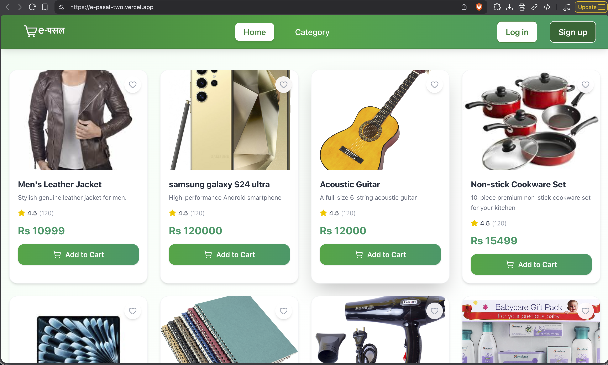

**Category List**  
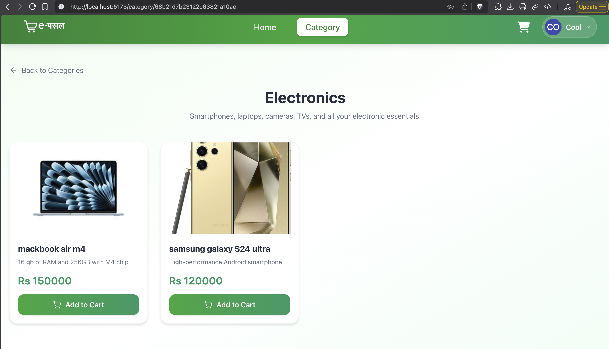

**Single Category View**  
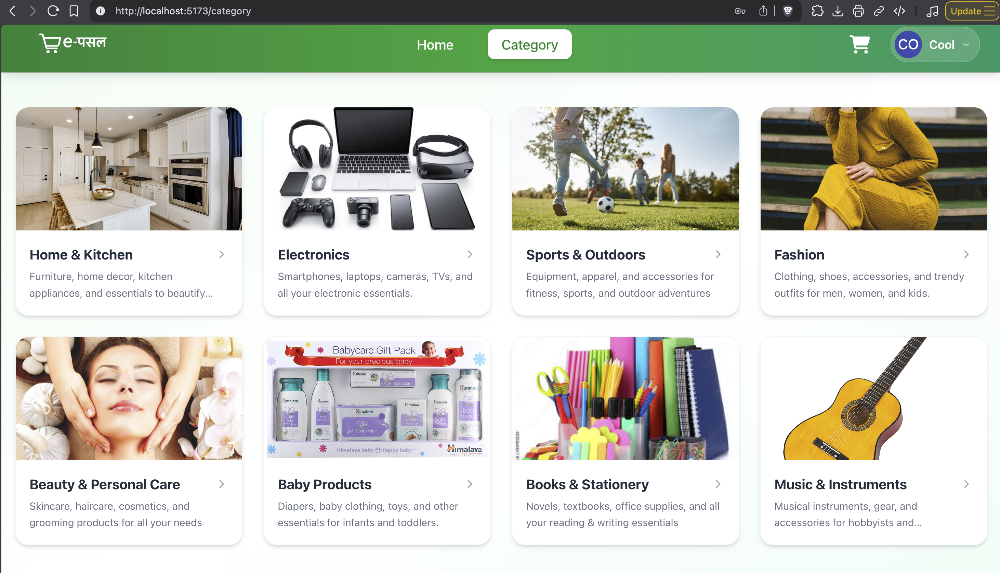

---

### Authentication

**Signup Page**  
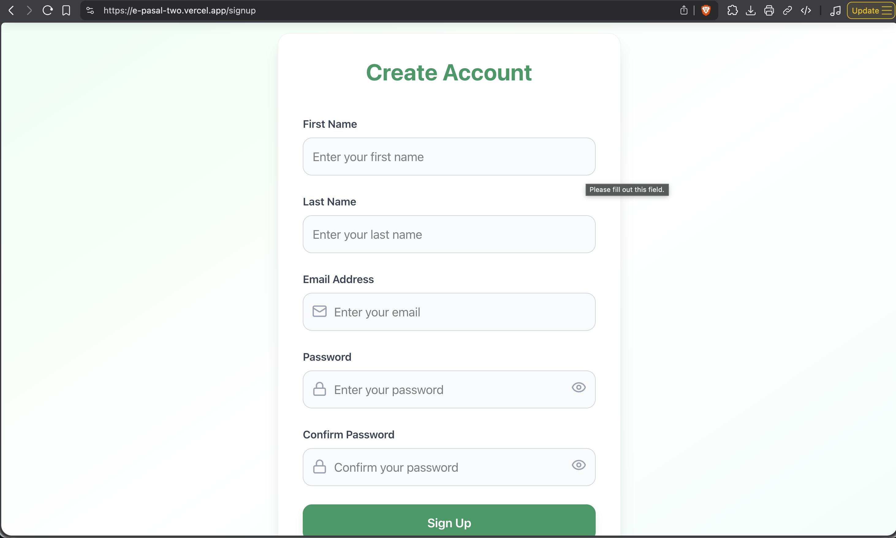

**Verification Email**  
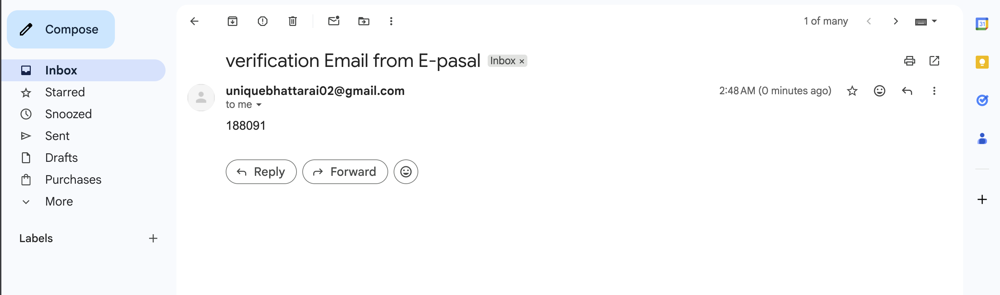

**OTP Verification**  
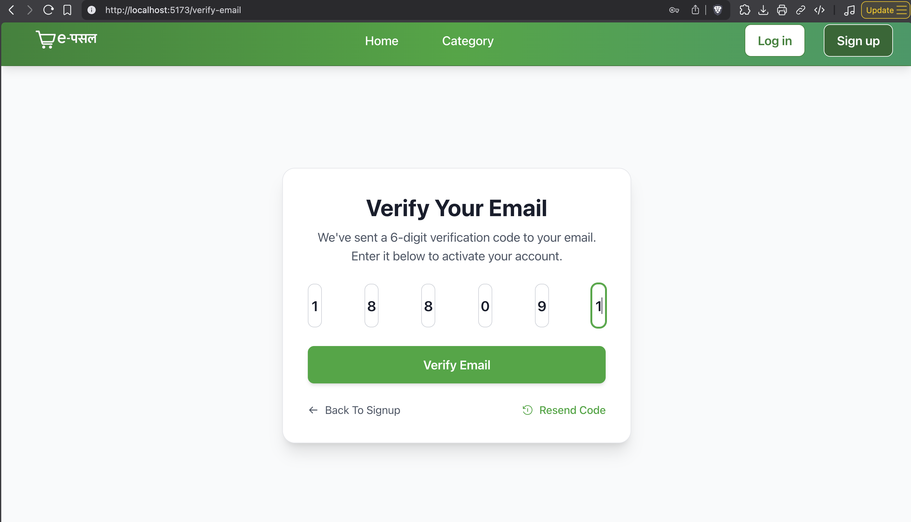

---

### Shopping & Payment Flow

**Shopping Cart**  
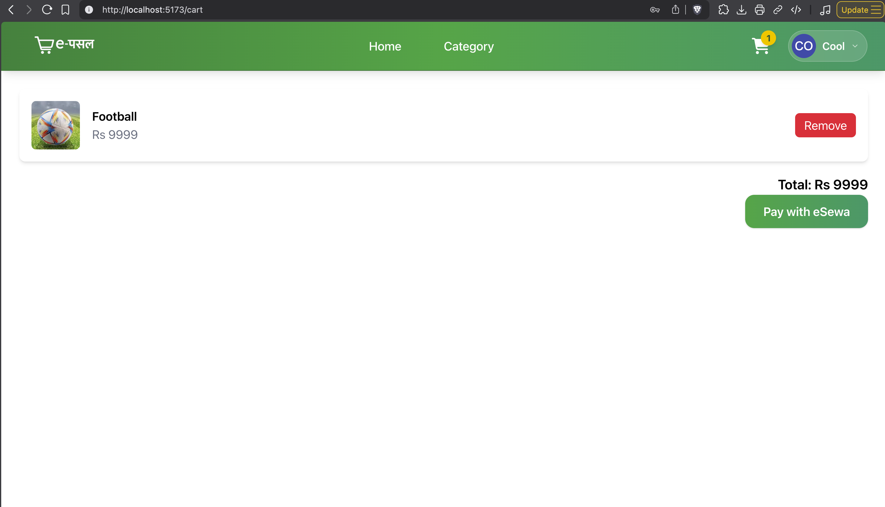

**eSewa Payment Processing**  
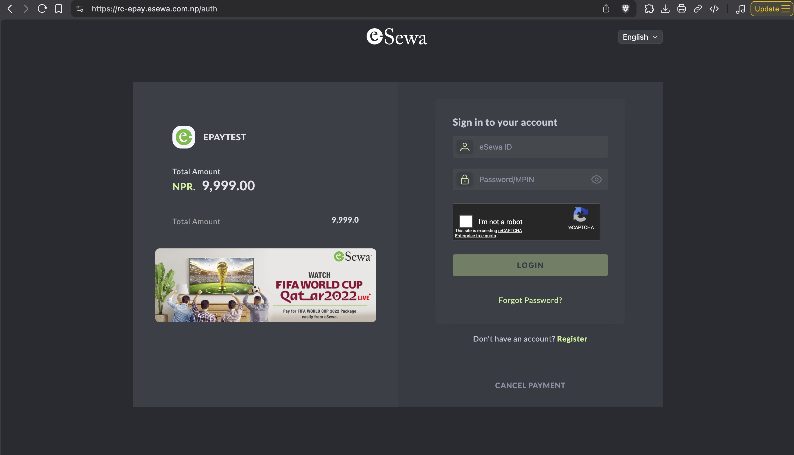
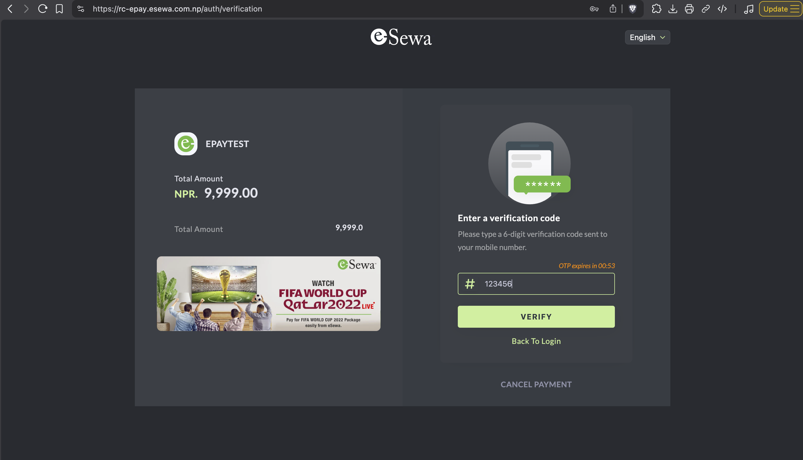
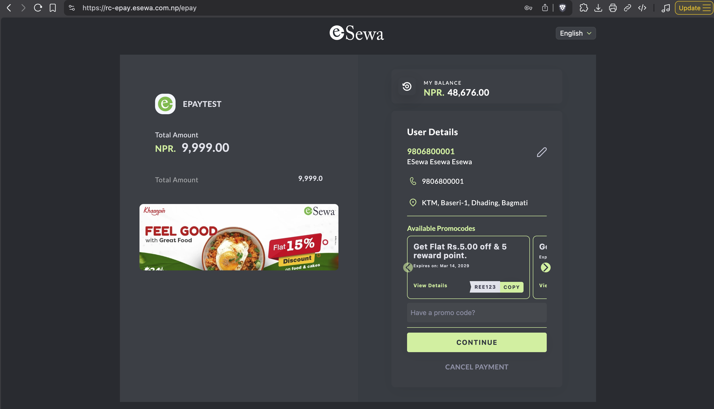
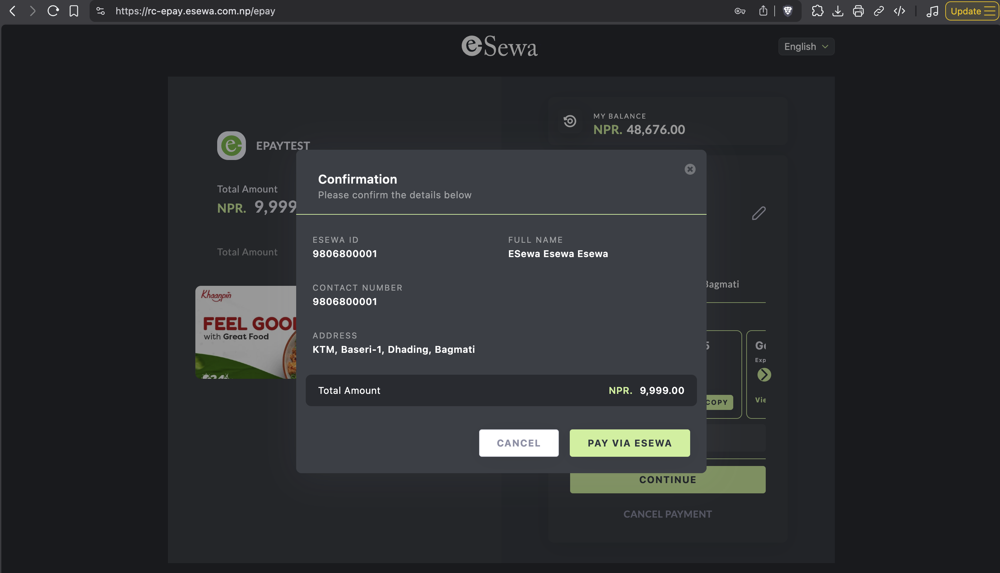

**Payment Successful**  
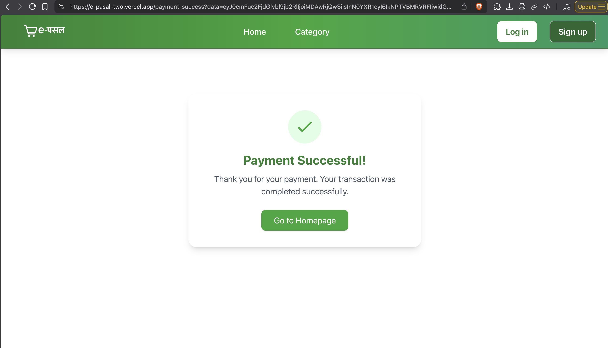

---

## 🚀 Local Development

### Prerequisites
- Node.js >= 18
- MongoDB Atlas account
- Cloudinary account

### 1. Clone & Install

```bash
git clone https://github.com/uniquebhattarai/E-pasal.git
cd E-pasal

# Install root dependencies
npm install

# Install frontend dependencies
cd frontend && npm install

# Install backend dependencies
cd ../server && npm install
```

### 2. Environment Variables

Create `server/.env`:
```env
PORT=3069
MONGODB_URL=your_mongodb_connection_string
JWT_SECRET=your_strong_random_secret
MAIL_HOST=smtp.gmail.com
MAIL_USER=your_email@gmail.com
MAIL_PASS=your_app_password
API_KEY=your_cloudinary_api_key
API_SECRET=your_cloudinary_api_secret
CLOUD_NAME=your_cloudinary_cloud_name
FRONTEND_URL=http://localhost:5173
```

Create `frontend/.env`:
```env
VITE_BASE_URL=http://localhost:3069/api/v1
VITE_FRONTEND_URL=http://localhost:5173
```

### 3. Run

```bash
# From root — runs both frontend and backend concurrently
npm run dev
```

Or separately:
```bash
# Backend
cd server && npm start

# Frontend
cd frontend && npm run dev
```


